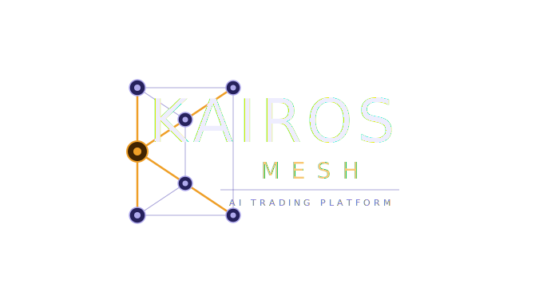

# Kairos Mesh

<p align="center">
  
</p>

[](LICENSE)

A governed multi-agent trading system that orchestrates 8 specialized LLM agents through a structured research and decision workflow. Paper-trading mode is the default and safe starting point. Live execution requires explicit configuration.

---

## What is Kairos Mesh?

Kairos Mesh is an open-source, structured trading research system. It runs a deterministic 4-phase pipeline per analysis request:

1. **Analysis** — three agents run in parallel: technical indicators, news sentiment, macro context
2. **Debate** — a bullish researcher and bearish researcher build opposing theses; a trader agent moderates
3. **Decision** — the trader agent produces a BUY / SELL / HOLD with entry, stop-loss, and take-profit levels
4. **Governance** — a deterministic risk engine validates the decision; an execution manager applies preflight checks before any order is submitted

LLM agents provide reasoning and synthesis. Risk enforcement is deterministic Python code — not an LLM judgment.

## What it does not do

- It does not trade autonomously or make unsupervised decisions
- It does not learn from past outcomes — there is no feedback loop from trade results to future runs
- It does not provide financial advice
- It is not production-ready for live capital without additional hardening (see [Limitations](docs/limitations.md))
- Live trading is disabled by default (`ALLOW_LIVE_TRADING=false`)

## Current scope

| Area | Status |
|------|--------|
| Paper trading (MetaAPI paper account) | Implemented, default |
| Simulation mode (DB only, no broker call) | Implemented |
| Live trading | Implemented but off by default; requires `ALLOW_LIVE_TRADING=true` and `TRADER_OPERATOR` role |
| 8-agent pipeline | Fully implemented |
| Debate phase | Conditional — only runs if all 3 debate agents have LLM enabled |
| Memory / learning loop | Not implemented — each run is stateless |
| Strategy monitoring (auto-run on signal) | Implemented via Celery Beat |
| Backtesting | Implemented (rule-based; LLM optional) |

## Architecture

```
┌────────────────────────────────────────────────────────────────┐
│                     React Dashboard (Vite)                     │
│  Terminal · Strategies · Orders · Backtests · Connectors       │
└────────────────────────┬───────────────────────────────────────┘
                         │ REST + WebSocket
┌────────────────────────▼───────────────────────────────────────┐
│                    FastAPI Backend                              │
│  ┌──────────────┐  ┌──────────────┐  ┌───────────────────┐    │
│  │  AgentScope  │  │  Risk Engine │  │  Execution Layer  │    │
│  │  Registry    │  │ (determin.)  │  │  Paper / Live     │    │
│  │  (8 Agents)  │  └──────────────┘  └───────────────────┘    │
│  └──────┬───────┘                                              │
│         │                                                      │
│  ┌──────▼──────────────────────────────────────────────┐       │
│  │           MCP Tool Layer (18 tools)                 │       │
│  │  Indicators · Patterns · News · Risk · Sizing       │       │
│  └─────────────────────────────────────────────────────┘       │
└────────────────────────────────────────────────────────────────┘
         │              │              │
    PostgreSQL       Redis        RabbitMQ
    Runs / Steps     Cache       Celery Queue + Beat
```

## Agent pipeline

| # | Agent | Role | Output advisory? |
|---|-------|------|-----------------|
| 1 | Technical Analyst | RSI, MACD, EMA, ATR, patterns, divergence, S/R | Advisory |
| 2 | News Analyst | Sentiment scoring, relevance filtering | Advisory |
| 3 | Market Context | Regime detection, session, macro | Advisory |
| 4 | Bullish Researcher | Bull thesis construction | Advisory (debate) |
| 5 | Bearish Researcher | Bear thesis construction | Advisory (debate) |
| 6 | Trader | BUY / SELL / HOLD with entry, SL, TP | Decision-bearing |
| 7 | Risk Manager | Position sizing, portfolio risk validation | Binding (tool overrides LLM) |
| 8 | Execution Manager | Preflight checks + order submission | Binding (deterministic preflight) |

Agents 4–5 (debate) only run when all 3 debate agents have LLM enabled. If skipped, the trader agent decides without debate input.

## Quick start

```bash
cp backend/.env.example backend/.env
# Edit backend/.env — set LLM_PROVIDER and your API keys
docker compose up --build
```

Access points after startup:
- Frontend: http://localhost:5173
- Backend API + docs: http://localhost:8000/docs
- Grafana: http://localhost:3000
- Prometheus: http://localhost:9090

Application default credentials: `admin@local.dev` / `admin1234`
Grafana default credentials: `admin` / `admin`

See [Getting Started](docs/getting-started.md) for full setup instructions.

## Tech stack

| Layer | Technologies |
|-------|-------------|
| Frontend | React 19, TypeScript, Material-UI 7, Vite, Lightweight Charts |
| Backend | FastAPI, SQLAlchemy 2, Alembic, Celery, AgentScope |
| Data | PostgreSQL 16, Redis 7, RabbitMQ 3 |
| Infra | Docker Compose, Helm/K8s, Prometheus, Grafana |
| LLM | Ollama (default), OpenAI, Mistral |
| Broker | MetaAPI (MT4/MT5) |

## Configuration

All configuration is via environment variables. Copy `backend/.env.example` to `backend/.env` and edit.

| Variable | Description | Default |
|----------|-------------|---------|
| `LLM_PROVIDER` | LLM backend (`ollama`, `openai`, `mistral`) | `ollama` |
| `DECISION_MODE` | Gating policy (`conservative`, `balanced`, `permissive`) | `balanced` |
| `ALLOW_LIVE_TRADING` | Enable real broker execution | `false` |
| `ENABLE_PAPER_EXECUTION` | Enable paper trading via MetaAPI (requires `METAAPI_TOKEN` and `METAAPI_ACCOUNT_ID`) | `true` |
| `METAAPI_TOKEN` | MetaAPI authentication token | — |

Full reference: [Configuration](docs/configuration.md)

## Project structure

```
backend/app/
  api/routes/          # REST endpoints (runs, strategies, backtests, trading)
  services/
    agentscope/        # 4-phase agent pipeline (registry, debate, schemas, toolkit)
    mcp/               # MCP tool server (18 computational tools)
    risk/              # Deterministic risk engine
    execution/         # Paper/live order execution
    strategy/          # Strategy designer and monitor
    market/            # Market data, news, instrument classification
    llm/               # LLM provider clients
  tasks/               # Celery tasks (analysis, backtest, strategy monitor)
  db/                  # SQLAlchemy models

frontend/src/
  pages/               # Terminal, Strategies, RunDetail, Orders, Backtests
  components/          # TradingViewChart, PortfolioKPIs, Layout

infra/
  docker/              # Prometheus config, Grafana dashboards
  helm/                # Kubernetes Helm charts
```

## Documentation

| Document | Description |
|----------|-------------|
| [Getting Started](docs/getting-started.md) | Prerequisites, install, first run |
| [Quickstart](docs/quickstart.md) | Minimal path to a working run |
| [Architecture](docs/architecture.md) | System layers, component map |
| [Runtime Flow](docs/runtime-flow.md) | Step-by-step: how a run executes |
| [Agents](docs/agents.md) | All 8 agents: roles, inputs, outputs |
| [Decision Pipeline](docs/decision-pipeline.md) | Analysis → debate → trade intent → gating |
| [Risk & Governance](docs/risk-and-governance.md) | Deterministic risk engine, limits, gates |
| [Execution](docs/execution.md) | Order flow, paper vs live, safeguards |
| [Memory](docs/memory.md) | Storage backends, transient vs persistent |
| [Configuration](docs/configuration.md) | Full environment variable reference |
| [Observability](docs/observability.md) | Metrics, logs, audit trail |
| [Paper vs Live](docs/paper-vs-live.md) | What differs, safety checklist |
| [Limitations](docs/limitations.md) | Known constraints, incomplete features |

## Limitations

This project has known limitations that affect production readiness. Read [docs/limitations.md](docs/limitations.md) before deploying in any environment involving real capital.

Key constraints:
- No learning loop — each run starts with fresh context
- Paper trading assumes exact fill at requested price (no slippage model)
- Live trading support is implemented but not hardened or audited for production
- Single LLM provider per run (no per-agent model selection)
- No rate limiting on API endpoints

## Contributing

See [CONTRIBUTING.md](CONTRIBUTING.md).

## Security

See [SECURITY.md](SECURITY.md) for the vulnerability reporting process and known security boundaries.

## Disclaimer

This software is for educational and research purposes only. It does not constitute financial advice. Past performance does not indicate future results. Use at your own risk. The authors accept no responsibility for financial losses incurred through use of this software.

## License

[MIT](LICENSE)
