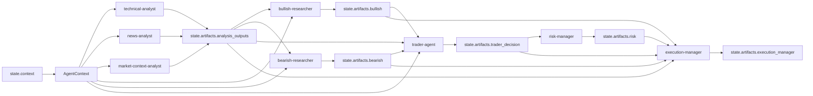
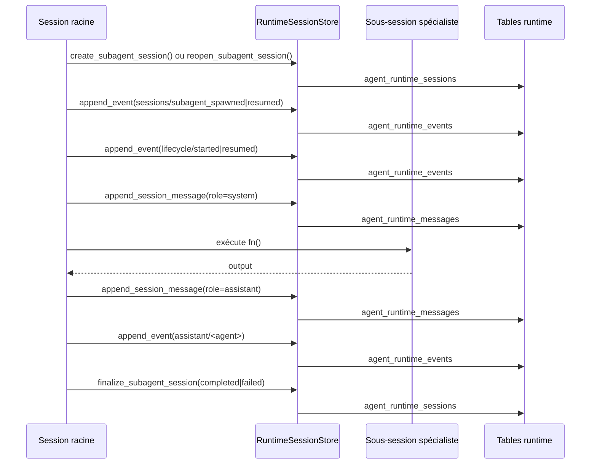

# Agentic V2 - Communication Entre Agents Observée

Cette page décrit uniquement la communication réellement observable dans le code lu. Elle ne suppose pas l'existence d'un bus, d'une outbox, d'une inbox autonome ou d'un protocole de conversation plus riche que ce qui est explicitement implémenté.

## Périmètre inspecté pour ce document

Ce document s'appuie sur les fichiers suivants:

- `backend/app/services/agent_runtime/runtime.py`
- `backend/app/services/agent_runtime/session_store.py`
- `backend/app/services/orchestrator/agents.py`
- `backend/app/api/routes/runs.py`
- `frontend/src/pages/RunDetailPage.tsx`

## Synthèse

Faits observés:

- La communication principale entre agents passe par l'état partagé du runtime (`state.context` et `state.artifacts`), pas par un dialogue libre agent-à-agent.
- L'ordre des échanges est imposé par `AgenticTradingRuntime._candidate_tools()`.
- Les sous-sessions SQL servent surtout à isoler, tracer, résumer et éventuellement reprendre un sous-agent.
- Une capacité de messagerie adressable existe via `sessions_send`, mais elle n'est pas exposée par l'API REST ni par l'UI lues.

Inférence:

- L'implémentation actuelle est plus proche d'une orchestration centralisée avec mémoire partagée que d'un système multi-agent autonome avec boîtes aux lettres persistantes.

## Vue d'ensemble des canaux

| Canal | Producteur observé | Lecteurs observés | Payload observé | Persistance observée |
| --- | --- | --- | --- | --- |
| `state.context` -> `AgentContext` | runtime (`resolve_market_context`, `load_memory_context`, `refresh_memory_context`) | analystes, débatteurs, trader, risk, execution | `market`, `news`, `memory_context`, `memory_signal`, métadonnées run | snapshot racine via `agent_runtime_sessions.state_snapshot`, miroir `trace.agentic_runtime` |
| `state.artifacts` | outils runtime et agents déjà passés | outils runtime suivants | `analysis_outputs`, `bullish`, `bearish`, `trader_decision`, `risk`, `execution_manager`, `execution_result` | snapshot racine + agrégats dans `analysis_runs.trace` |
| sous-sessions runtime | `_run_specialist_subagent()` | UI, WS, hydratation API, reprise interne | métadonnées de session, messages `system`/`assistant`, événements `lifecycle` et `sessions` | `agent_runtime_sessions`, `agent_runtime_messages`, `agent_runtime_events` |
| messagerie ciblée | `_tool_sessions_send()` | session enfant ciblée, reprise optionnelle | message `user`, `sender_session_key`, flag `resume` | `agent_runtime_messages` + événement `sessions/message_sent` |

## 1. Canal de contexte partagé

Le runtime construit un `AgentContext` à partir de `state.context` via `_build_context()`. Ce contexte est ensuite injecté dans les appels d'agents.

Contenu effectivement injecté:

- `pair`
- `timeframe`
- `mode`
- `risk_percent`
- `market_snapshot`
- `news_context`
- `memory_context`
- `memory_signal`

Conséquence observable:

- les agents ne vont pas lire directement les tables SQL pour se parler
- ils reçoivent un contexte préparé par le runtime central
- la mémoire rappelée agit comme un canal commun injecté dans plusieurs étapes, surtout pour `news-analyst`, les débatteurs et `trader-agent`

## 2. Canal principal de passation d'artefacts

La chaîne inter-agents observée est une chaîne de lecture/écriture sur `state.artifacts`. C'est le mécanisme principal de communication métier.

| Émetteur | Artefact écrit | Lecteurs suivants | Détail observé |
| --- | --- | --- | --- |
| `run_technical_analyst` | `state.artifacts["analysis_outputs"]["technical-analyst"]` | débatteurs, trader, exécution, agrégateur final | sortie technique persistée aussi en `AgentStep` |
| `run_news_analyst` | `state.artifacts["analysis_outputs"]["news-analyst"]` | débatteurs, trader, exécution, agrégateur final | utilise `news_context` et `memory_context` |
| `run_market_context_analyst` | `state.artifacts["analysis_outputs"]["market-context-analyst"]` | débatteurs, trader, exécution, agrégateur final | consomme surtout `market_snapshot` |
| `run_bullish_researcher` | `state.artifacts["bullish"]` | trader, exécution, contrôle live dégradé | lit un snapshot compacté de `analysis_outputs` |
| `run_bearish_researcher` | `state.artifacts["bearish"]` | trader, exécution, contrôle live dégradé | lit le même snapshot compacté |
| runtime avant trader | `state.artifacts["evidence_bundle"]` | finalisation du run, trace finale, gouverneur runtime | construit depuis `analysis_outputs`, `bullish`, `bearish`; non passé en argument direct à `TraderAgent.run()` |
| `run_trader_agent` | `state.artifacts["trader_decision"]` | risk manager, execution manager, finalisation du run | consomme `analysis_outputs`, `bullish`, `bearish`, `memory_signal` |
| runtime après trader | `state.artifacts["runtime_governor"]` | sélection de `refresh_memory_context` ou passage à l'exécution | gouvernance déterministe du second pass |
| `run_risk_manager` | `state.artifacts["risk"]` | execution manager, finalisation du run | étape inline, pas de sous-session dédiée observée |
| `run_execution_manager` | `state.artifacts["execution_manager"]`, `state.artifacts["execution_result"]` | finalisation du run | étape inline, validation contrat puis exécution éventuelle |

Point important:

- les débatteurs haussier et baissier ne se parlent pas directement
- ils reçoivent chacun un snapshot compacté de `analysis_outputs`
- le trader lit ensuite les deux sorties et arbitre

## 3. Ordonnancement réel de la communication

L'ordre n'est pas libre. `_candidate_tools()` impose les préconditions de communication suivantes:

1. `resolve_market_context`
2. `load_memory_context`
3. analystes `technical`, `news`, `market-context`
4. `bullish`
5. `bearish`
6. `trader`
7. `risk`
8. éventuel `refresh_memory_context` si `runtime_governor.should_second_pass`
9. `execution`

Effet observable:

- un agent ne lit que des artefacts déjà produits
- il n'existe pas de boucle pair-à-pair ouverte où deux agents échangent librement jusqu'à convergence
- la coordination reste pilotée par le runtime racine

## 4. Sous-sessions spécialisées

Les spécialistes `technical`, `news`, `market-context`, `bullish`, `bearish` et `trader` passent par `_run_specialist_subagent()`.

Séquence observée pour une sous-session:

1. Le runtime racine crée ou rouvre une sous-session via `RuntimeSessionStore`.
2. Il émet un événement `sessions/subagent_spawned` ou `sessions/subagent_resumed`.
3. Il émet un événement `lifecycle/started` ou `lifecycle/resumed` pour la session enfant.
4. Il écrit un message `system` dans `agent_runtime_messages` avec un texte du type `"<label> started."` ou `"<label> resumed."`.
5. Il exécute la fonction métier du sous-agent.
6. Il compacte la sortie et l'écrit comme message `assistant` dans la session enfant.
7. Il émet un événement `assistant/<agent_name>` avec un résumé compact.
8. Il finalise la session enfant en `completed` ou `failed`.
9. Il émet les événements `lifecycle/completed` ou `lifecycle/failed`, puis `sessions/subagent_completed` ou `sessions/subagent_failed`.

Ce que cela veut dire:

- la session enfant a un historique propre
- le parent peut voir qu'un sous-agent a démarré, repris, terminé ou échoué
- le contenu persistant visible est surtout un message de démarrage et un résumé final
- le code lu ne montre pas une boucle conversationnelle riche entre sessions pendant l'exécution nominale

## 5. Messagerie adressable entre sessions

Une capacité plus directe existe via `_tool_sessions_send()`.

Comportement observé:

- le runtime exige un `session_key` cible
- il écrit un message `role="user"` dans la session cible
- il renseigne `sender_session_key`
- il émet un événement `sessions/message_sent`
- il peut ensuite appeler `sessions_resume` si `resume=true`

Ce canal est réel dans le code, mais ses limites observées sont importantes:

- aucune route REST dédiée ne l'expose dans `backend/app/api/routes/runs.py`
- `RunDetailPage` affiche sessions, messages et événements, mais ne fournit pas d'action pour envoyer un message
- le flux principal du run ne l'utilise pas pour faire collaborer les agents analystes, débatteurs, trader, risk et execution

## 6. Ce que chaque agent lit réellement

| Agent / étape | Ce qu'il lit | Ce qu'il écrit |
| --- | --- | --- |
| `technical-analyst` | `AgentContext` avec marché et paramètres run | `analysis_outputs.technical-analyst` |
| `news-analyst` | `AgentContext.news_context`, `AgentContext.memory_context` | `analysis_outputs.news-analyst` |
| `market-context-analyst` | `AgentContext.market_snapshot` | `analysis_outputs.market-context-analyst` |
| `bullish-researcher` | snapshot compact de `analysis_outputs`, `memory_context` | `bullish` |
| `bearish-researcher` | snapshot compact de `analysis_outputs`, `memory_context` | `bearish` |
| `trader-agent` | `analysis_outputs`, `bullish`, `bearish`, `memory_signal` via `ctx` | `trader_decision` |
| `risk-manager` | `trader_decision` | `risk` |
| `execution-manager` | `trader_decision`, `risk`, `analysis_outputs`, `bullish`, `bearish` | `execution_manager`, `execution_result` |

Observation structurante:

- `risk-manager` et `execution-manager` ne sont pas lancés comme sous-sessions spécialisées dans le flux lu
- leur communication avec les étapes précédentes est donc purement structurée par `state.artifacts`

## 7. Persistance de la communication

| Support | Ce qui est durablement stocké | Rôle réel |
| --- | --- | --- |
| `agent_runtime_sessions` | session racine, sessions enfants, `summary`, `resume_count`, `state_snapshot` | reprise et hydratation |
| `agent_runtime_messages` | messages `system`, `user`, `assistant` par session | historique ciblé et audit de session |
| `agent_runtime_events` | événements ordonnés `tool`, `assistant`, `lifecycle`, `sessions` | streaming WS et journal durable |
| `analysis_runs.trace` | miroir runtime + agrégats top-level | compatibilité API/UI et lecture simplifiée |

Point important:

- `analysis_runs.trace.agentic_runtime.session_history` n'est pas la source primaire à l'écriture
- l'historique est hydraté à la lecture depuis `agent_runtime_messages`

## 8. Diagrammes alignés sur le code

## 9. Ce qui n'est pas observé

Absences observées dans le code lu:

- pas de messagerie pair-à-pair utilisée dans le flux nominal entre analystes et débatteurs
- pas de boîte de réception autonome consommée en boucle par les sous-agents
- pas de bus d'événements ou d'outbox durable séparée des tables runtime
- pas de replay conversationnel riche à partir des seuls messages de session
- pas d'API publique dédiée pour piloter `sessions_send`, `sessions_resume`, `sessions_history` ou `sessions_list`
- pas d'UI permettant à un opérateur d'envoyer un message à une session enfant

## 10. Observé vs inféré

| Type | Point |
| --- | --- |
| Fait observé | La communication métier entre agents est séquentielle et structurée par `state.artifacts`. |
| Fait observé | Les sous-sessions spécialisées persistent des messages et des événements, mais le contenu conversationnel observé reste minimal. |
| Fait observé | `sessions_send` permet un message ciblé persistant avec reprise optionnelle. |
| Fait observé | Ce canal n'est pas exposé par l'API ou l'UI inspectées. |
| Inférence | Le système actuel implémente une coordination centralisée, pas une société d'agents dialoguant librement. |
| Hypothèse non vérifiable ici | D'autres consommateurs internes ou scripts d'exploitation pourraient invoquer ces outils runtime hors des routes et pages inspectées. |
