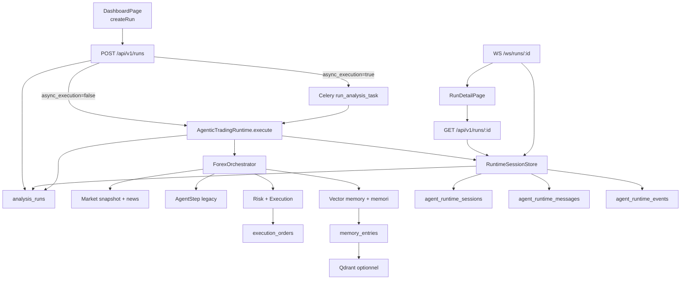
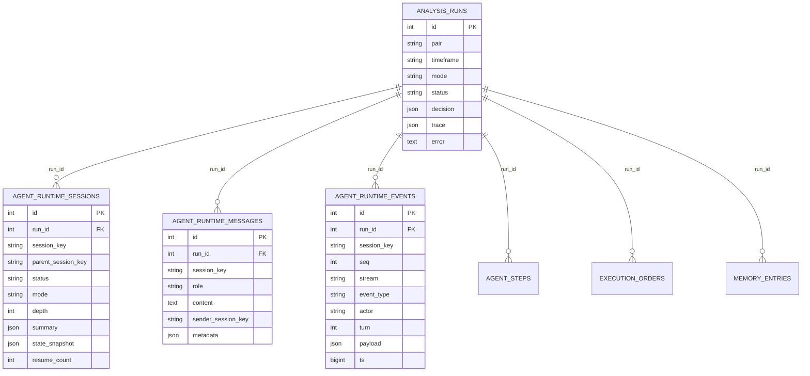

# Agentic V2 - Architecture Observée

Cette page décrit uniquement l'architecture visible dans le code lu.

## Objectif du runtime

Le runtime `agentic_v2` orchestre l'exécution d'un run d'analyse/trading Forex en enchaînant des outils runtime, en persistant des sessions/messages/événements SQL, puis en agrégeant une décision finale dans `analysis_runs.decision` et `analysis_runs.trace`.

## Périmètre réellement inspecté

Le périmètre inspecté couvre:

- le runtime backend `backend/app/services/agent_runtime/`
- les modèles SQL runtime et `analysis_runs`
- les migrations Alembic `0005` et `0006`
- les routes `/runs`, la task Celery et le WebSocket `/ws/runs/{run_id}`
- l'orchestrator, les agents, la couche risque/exécution, la mémoire vectorielle et `memori`
- `DashboardPage`, `RunDetailPage`, `frontend/src/types/index.ts` et `frontend/src/api/client.ts`

## Composants observés

| Composant | Rôle observé | Nature principale |
| --- | --- | --- |
| `POST /api/v1/runs` | Crée un `AnalysisRun`, le met en queue ou l'exécute | API |
| `run_analysis_task.execute()` | Exécute le runtime dans Celery | Orchestration asynchrone |
| `AgenticTradingRuntime` | Boucle runtime, sélection des outils, finalisation | Orchestration déterministe + appels LLM optionnels |
| `AgenticRuntimePlanner` | Choisit le prochain outil parmi les candidats | LLM optionnel avec fallback déterministe |
| `RuntimeSessionStore` | Stocke sessions/messages/events et hydrate `trace` | Persistance SQL + miroir compatibilité |
| `ForexOrchestrator` | Fournit market snapshot, mémoire, agents, exécution | Composition backend |
| Agents analystes / trader / risk / execution | Produisent les sorties métier | Déterministe avec enrichissements LLM selon agent |
| `analysis_runs` | État du run, décision finale, trace large | SQL |
| `agent_runtime_sessions` | Snapshot et métadonnées de sessions | SQL |
| `agent_runtime_messages` | Historique de messages par session | SQL |
| `agent_runtime_events` | Journal d'événements runtime durable | SQL |
| `/ws/runs/{run_id}` | Diffusion temps réel par polling DB | WebSocket |
| `RunDetailPage` | Visualisation runtime côté UI | Frontend |

## Flux d'exécution réel

1. `POST /api/v1/runs` crée un `AnalysisRun` en `pending` avec `trace.runtime_engine = "agentic_v2"` et `trace.requested_metaapi_account_ref` si fourni.
2. Si `async_execution=true`, la route publie `run_analysis_task`; sinon elle appelle directement `run_with_selected_runtime()`.
3. `run_with_selected_runtime()` instancie `AgenticTradingRuntime` et appelle `execute()`.
4. `execute()` met le run en `running`, résout éventuellement le compte MetaApi, puis tente une reprise via `RuntimeSessionStore.restore_state()`.
5. Si aucun état n'existe, le runtime initialise une session racine `analysis-run:{run.id}` dans SQL et dans `trace.agentic_runtime`.
6. À chaque tour, le runtime calcule la liste des outils candidats à partir de l'état courant.
7. Si plusieurs candidats sont possibles, `AgenticRuntimePlanner` peut choisir via LLM; sinon le choix est déterministe.
8. Chaque appel d'outil crée un événement `tool/start`, exécute l'outil, enregistre un `AgentStep` legacy, puis écrit un événement `tool/result`.
9. Les outils spécialistes (`technical`, `news`, `market-context`, `bullish`, `bearish`, `trader`) passent par `_tool_spawn_subagent()`, qui crée ou rouvre une sous-session, écrit des messages système/assistant, puis finalise la sous-session.
10. Après chaque outil, `persist_session()` met à jour le snapshot racine SQL et le miroir `trace.agentic_runtime`.
11. Quand il n'y a plus de candidats, le runtime construit `run.decision` à partir de `trader_decision`, `risk`, `execution`, `runtime_governor` et `evidence_bundle`.
12. Le runtime enrichit ensuite `run.trace` avec les sorties top-level observées: `market`, `news`, `analysis_outputs`, mémoire, gouverneur, workflow, debug trace éventuelle, métadonnées de persistance mémoire.
13. En fin de run, une mémoire vectorielle de type `run_outcome` est stockée; une mémoire `memori` peut aussi être écrite si activée.
14. En cas d'erreur, le runtime écrit `run.status = failed`, `run.error`, une trace d'échec et un événement `lifecycle/failed`.

## Persistance SQL réelle

| Table | Contenu réellement stocké | Utilisation observée |
| --- | --- | --- |
| `analysis_runs` | run métier, `status`, `decision`, `trace`, `error` | entrée API, décision finale, compatibilité UI |
| `agent_runtime_sessions` | session racine et sous-sessions, `summary`, `state_snapshot`, `resume_count`, `source_tool` | reprise, liste des sessions, hydratation API |
| `agent_runtime_messages` | messages par session, rôle, contenu, sender, metadata | hydratation `session_history`, visualisation UI |
| `agent_runtime_events` | événements ordonnés par `seq`, stream, actor, payload, turn | WebSocket, hydratation `trace.agentic_runtime.events` |
| `agent_steps` | sorties legacy par agent | affichage `Étapes agents` dans `RunDetailPage` |
| `execution_orders` | demandes/réponses d'exécution, idempotence | simulation/paper/live |
| `memory_entries` | cas mémoires vectoriels liés aux runs | rappel mémoire vectoriel et signal mémoire |

Observations complémentaires:

- Les messages sont prunés par session au-delà de `agentic_runtime_history_limit` via `_prune_session_messages()`.
- Les événements ne sont pas prunés en base dans le code lu; seul le miroir `trace.agentic_runtime.events` est limité par `agentic_runtime_event_limit`.
- Le vrai snapshot de reprise est stocké dans `agent_runtime_sessions.state_snapshot`; il n'est pas exposé par l'API observée.

## Rôle de `analysis_runs.trace`

`analysis_runs.trace` n'est pas un reliquat passif; il reste activement alimenté.

| Zone de `trace` | Rôle observé | Remarques |
| --- | --- | --- |
| `trace.agentic_runtime` | Miroir compatibilité du runtime | Contient `engine`, `session_key`, `status`, `plan`, `sessions`, `events`, `session` |
| `trace.market` / `trace.news` | Contexte marché/news final utilisé par le run | Écrits en fin de run |
| `trace.analysis_outputs` | Sorties des 3 analystes | Écrites en fin de run |
| `trace.bullish` / `trace.bearish` | Paquets de débat | Écrits en fin de run |
| `trace.memory_context`, `trace.memory_signal`, `trace.memory_runtime`, `trace.memory_retrieval_context` | Trace du rappel mémoire | Écrits en fin de run |
| `trace.evidence_bundle`, `trace.runtime_governor` | Gouvernance et synthèse d'évidence | Écrits en fin de run |
| `trace.requested_metaapi_account_ref`, `trace.runtime_engine` | Compatibilité et audit | Semés dès la création du run |
| `trace.workflow`, `trace.workflow_mode` | Héritage orchestrator/top-level | `workflow` contient 8 étapes legacy, pas le plan runtime complet |
| `trace.debug_trace_meta`, `trace.debug_trace_file`, `trace.debug_trace` | Debug optionnel | Dépend des settings |
| `trace.memory_persistence` | Résultat de persistance vectorielle + memori | Ajouté après finalisation |

Point important:

- `trace.agentic_runtime.session_history` n'est pas maintenu à l'écriture par le runtime; il est hydraté à la lecture depuis `agent_runtime_messages`.
- `trace.agentic_runtime.state_snapshot` existe dans `hydrate_trace(include_state_snapshot=True)`, mais l'API lue n'appelle jamais cette option.

## Streaming et diffusion temps réel

Le streaming observé n'est pas un push event-driven côté serveur. C'est un WebSocket qui poll la base.

1. Le client ouvre `/ws/runs/{run_id}` avec un token Bearer ou un token en query string.
2. Le serveur poll la base toutes les `ws_run_poll_seconds` secondes.
3. Si `run.status` ou `run.updated_at` changent, le serveur envoie un message `type = "status"`.
4. Le serveur lit ensuite les événements `agent_runtime_events` après `last_event_id` et envoie un message `type = "event"` par événement.
5. Si aucun événement SQL n'est encore vu et `last_event_id == 0`, le serveur relit `trace.agentic_runtime.events`.
6. Le socket se ferme quand le run est `completed` ou `failed`.

Streams d'événements observés:

| Stream | Usage observé |
| --- | --- |
| `lifecycle` | start, resume, completed, failed |
| `tool` | start/result de chaque outil |
| `assistant` | décisions du planner, sorties de sous-agent |
| `sessions` | spawn, completion, failure, message sent |

## API runtime observée

| Endpoint | Comportement observé |
| --- | --- |
| `GET /api/v1/runs` | Liste de runs, sans hydratation runtime |
| `POST /api/v1/runs` | Crée un run et retourne un payload hydraté si exécution inline ou après mise en queue |
| `GET /api/v1/runs/{id}` | Retourne `RunDetailOut` avec `steps` legacy et `trace` runtime hydratée |
| `WS /ws/runs/{run_id}` | Envoie `status` et `event` par polling DB |

Capacités non exposées en REST dans le code lu:

- aucune route dédiée pour `agent_runtime_sessions`
- aucune route dédiée pour `agent_runtime_messages`
- aucune route dédiée pour `agent_runtime_events`
- aucune route dédiée pour `resume`, `send message`, `list sessions` malgré les outils internes présents dans `runtime.py`

## UI runtime observée

### `DashboardPage`

- charge les runs via `api.listRuns()` sans paramètre `limit`; le backend utilise alors sa valeur par défaut `limit=50`
- recharge les runs toutes les 5 secondes
- affiche un historique paginé côté client à 10 lignes par page
- n'affiche ni sessions runtime, ni événements runtime, ni messages runtime

### `RunDetailPage`

- charge `GET /runs/{id}`
- extrait `runtime.events`, `runtime.sessions` et `runtime.session_history` depuis `trace.agentic_runtime`
- ouvre un WebSocket `/ws/runs/{id}`
- si le WS tombe, bascule sur un polling HTTP toutes les 15 secondes
- affiche:
  - la décision finale
  - les `AgentStep` legacy
  - les sessions runtime
  - les messages par session
  - les événements runtime
  - la trace brute complète

Limites UI observées:

- pas de filtre par stream
- pas de pagination des événements
- pas d'action de pilotage runtime
- pas de vue dédiée pour les snapshots racine

Types runtime réellement exposés au frontend:

| Type frontend | Champs observés |
| --- | --- |
| `RuntimeEvent` | `id`, `seq`, `type`/`stream`, `name`, `turn`, `payload`, `data`, `runId`, `sessionKey`, `created_at`, `ts` |
| `RuntimeSessionEntry` | `session_key`, `parent_session_key`, `status`, `mode`, `depth`, `role`, `turn`, `current_phase`, `resume_count`, `summary`, `metadata`, `error` |
| `RuntimeSessionMessage` | `id`, `session_key`, `role`, `content`, `sender_session_key`, `created_at`, `metadata` |

## Diagrammes alignés sur le code

## Frontière déterministe et sûreté

| Zone | Observé dans le code | Conséquence |
| --- | --- | --- |
| Orchestration principale | Le calcul des candidats et la boucle `while state.turn < state.max_turns` sont déterministes | Le runtime a un squelette déterministe stable |
| Choix du prochain outil | Le planner LLM n'intervient que si plusieurs candidats existent et si son LLM est activé | Fallback au premier candidat sinon |
| `technical-analyst` | Score de base déterministe, LLM optionnel, désactivé par défaut | La direction technique existe sans LLM |
| `news-analyst` | Analyse déterministe + LLM optionnel, activé par défaut, circuit breaker local | Le biais news reste contrôlé même si le LLM échoue |
| `market-context-analyst` | Calcul contextuel déterministe, note LLM optionnelle | Le contexte n'est pas dépendant du LLM |
| `trader-agent` | Décision déterministe, note d'exécution LLM optionnelle, désactivée par défaut | Les gates métier sont calculés hors LLM |
| `risk-manager` | `RiskEngine` décide d'abord; un LLM éventuel ne peut pas renverser un rejet déterministe | La sûreté risque reste bornée par le code |
| `execution-manager` | Plan déterministe; si LLM activé, same-side JSON strict sinon HOLD | Le LLM ne peut pas imposer un flip de side |
| Exécution broker | Validation supplémentaire de contrat d'exécution + idempotence d'ordre | Réduction du risque de double soumission ou d'exécution incohérente |
| Live mode | Le runtime bloque certains cas dégradés ou incohérents en `live` | Le mode live est plus strict que simulation/paper |

Points de prudence observés:

- la reprise est basée sur un snapshot SQL, mais aucun lease/heartbeat n'est visible dans le code lu
- les champs `correlation_id` et `causation_id` existent, mais ne sont pas alimentés par le runtime courant
- `analysis_runs.trace` mélange encore sorties métier et miroir runtime; la frontière SQL vs compatibilité n'est donc pas totalement séparée
