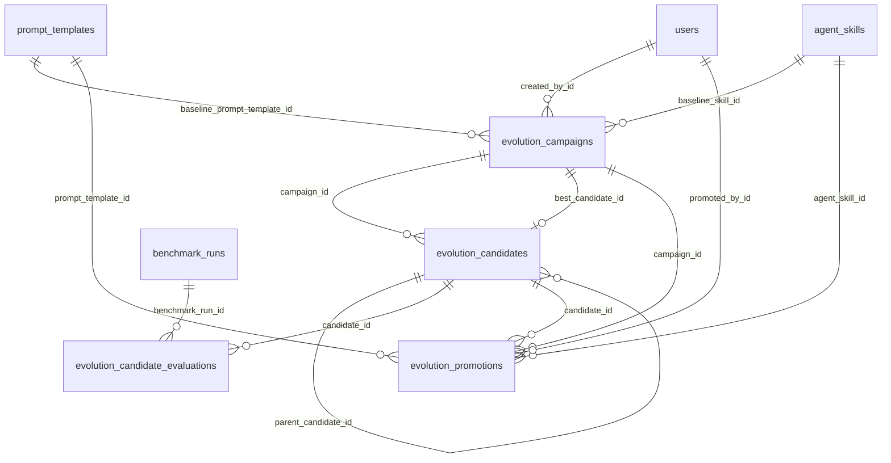

# Evolution Lab (GH-28)

## 1) Vue d'ensemble

L'**Evolution Lab** est un sous-système offline de Kairos Mesh dédié à l'amélioration continue des prompts et skills des 9 agents de trading. Il ne participe pas au pipeline de décision/exécution live : son objectif est d'explorer des variantes, de les scorer, puis de proposer les meilleures candidates à la promotion.

Le principe est simple : une campagne d'évolution part d'une baseline (prompt template + skills versionnés), génère des candidates via un mutateur LLM, puis les évalue avec le **BenchmarkEngine** existant (réutilisation de GH-24). Chaque candidate est persistée avec son score et ses métriques agrégées pour construire une progression observable (fitness series, leaderboard, détail par campagne).

La gouvernance est volontairement stricte : pas d'auto-promotion, pas d'activation implicite, pas d'impact sur le moteur de risque ni sur l'exécution broker. Toute promotion vers des artefacts actifs reste une action humaine explicite et traçable.

---

## 2) Architecture

```mermaid
flowchart LR
    subgraph FE[Frontend React]
      Page["/evolution-lab\nEvolutionLabPage"]
      ApiClient["evolutionApi.ts"]
      Page --> ApiClient
    end

    subgraph API[FastAPI]
      Routes["/api/v1/evolution/*\nroutes/evolution.py"]
      Service["EvolutionService\nCRUD + état + promotion"]
      Routes --> Service
    end

    subgraph ASYNC[Celery]
      Task["run_evolution_campaign\ntasks/evolution.py\nqueue: evolution"]
      Engine["EvolutionEngine\nengine.py"]
      Mutator["PromptMutator\nmutator.py"]
      Evaluator["BenchmarkEvaluator\nevaluator.py"]
      Task --> Engine
      Engine --> Mutator
      Engine --> Evaluator
    end

    subgraph BENCH[Benchmark existant]
      BenchEngine["BenchmarkEngine"]
    end

    subgraph DB[(PostgreSQL)]
      EC["evolution_campaigns"]
      ECA["evolution_candidates"]
      ECE["evolution_candidate_evaluations"]
      EP["evolution_promotions"]
      PT["prompt_templates (baseline source + promotion target)"]
      SK["agent_skills (baseline source + promotion target)"]
      BR["benchmark_runs / benchmark_cases"]
    end

    ApiClient --> Routes
    Routes --> Task
    Service <--> EC
    Service <--> ECA
    Service <--> EP
    Service <--> PT
    Service <--> SK

    Engine <--> EC
    Engine <--> ECA
    Evaluator --> BenchEngine
    Evaluator <--> ECE
    Evaluator <--> BR
```

---

## 3) Flux principal

### Lancement d'une campagne (end-to-end)

1. L'utilisateur ouvre `/evolution-lab` et soumet le formulaire de campagne.
2. Le frontend appelle `POST /api/v1/evolution/campaigns`.
3. L'API valide le rôle (admin/super-admin) et délègue à `EvolutionService.create_campaign`.
4. Le service valide : agent autorisé, bornes (`max_iterations`, `max_candidates`, `max_llm_calls`, `budget_usd_limit`), baseline prompt/skill existants.
5. La campagne est créée en base avec statut `pending`.
6. L'API enqueue la task Celery `run_evolution_campaign` sur la queue `evolution` et enregistre `celery_task_id`.

### Boucle d'évolution

7. Le worker exécute `EvolutionEngine.run_campaign` (statut `running`, `started_at`).
8. L'engine charge/crée la baseline en snapshot dans `evolution_candidates` (génération 0).
9. La baseline est évaluée par `BenchmarkEvaluator` si nécessaire.
10. Boucle tant qu'aucune borne n'est atteinte et pas d'annulation :
    - mutation (`PromptMutator`) à partir du meilleur parent courant,
    - évaluation (`BenchmarkEvaluator` via `BenchmarkEngine`),
    - persistance score/métriques,
    - mise à jour du meilleur candidat (`best_candidate_id`).
11. Arrêt sur borne (itérations/candidats/calls/budget) ou `cancel_requested`.
12. Statut terminal : `completed` ou `cancelled` (ou `failed` en exception) + `completed_at`.

### Restitution frontend

13. Le frontend recharge la liste des campagnes et le détail (`candidates`, `fitness-series`).
14. Les tabs affichent : campagnes, création, leaderboard local des meilleurs scores.

---

## 4) Composants backend

### `EvolutionEngine` (`backend/app/services/evolution/engine.py`)

- Orchestrateur principal de campagne.
- Algorithme :
  - bootstrap baseline,
  - évaluer baseline,
  - boucle **mutation -> évaluation -> sélection du meilleur -> itération**,
  - mise à jour compteurs (`consumed_iterations`, `consumed_candidates`, `llm_calls_used`, `consumed_budget_usd`).
- Conditions d'arrêt intégrées : bornes + annulation demandée.

### `PromptMutator` (`backend/app/services/evolution/mutator.py`)

- Génère un nouveau candidat via `LlmClient.chat_json`.
- Prompt de mutation conservatif (compatibilité domaine, pas de référence live trading).
- Exige un JSON strict avec :
  - `system_prompt`
  - `user_prompt_template`
  - `skills` (liste non vide)
- Rejette les payloads invalides (candidate `rejected` + exception 422).

### `BenchmarkEvaluator` (`backend/app/services/evolution/evaluator.py`)

- Adapter entre Evolution Lab et BenchmarkEngine existant.
- Crée un `BenchmarkFixture` injectant le prompt/template candidat (shadow config).
- Crée un `BenchmarkRun`, exécute `BenchmarkEngine().execute_run(...)`.
- Agrège les résultats des `BenchmarkCase` (5 dimensions) en score fitness.
- Persiste :
  - `evolution_candidate_evaluations`
  - `candidate.metrics_summary`
  - `candidate.fitness_score`
  - `candidate.status = evaluated`

### `EvolutionService` (`backend/app/services/evolution/service.py`)

- Couche métier CRUD + gouvernance d'état.
- Responsabilités :
  - créer/lister/détailler les campagnes,
  - annuler une campagne,
  - lister candidats (tri génération/fitness),
  - produire la `fitness_series`,
  - promouvoir manuellement un candidat.
- Promotion :
  - crée une nouvelle version dans `prompt_templates` et/ou `agent_skills`,
  - journalise dans `evolution_promotions`,
  - marque la candidate `promoted`.

---

## 5) Modèle de données



### Tables clés

- `evolution_campaigns` : configuration de campagne, bornes, état, consommations, meilleur candidat.
- `evolution_candidates` : snapshots de prompts/skills par génération + score.
- `evolution_candidate_evaluations` : détail d'évaluation benchmark + score agrégé.
- `evolution_promotions` : traçabilité des promotions vers artefacts versionnés.

---

## 6) API REST

Base path : `/api/v1/evolution`

- `POST /campaigns` — crée + lance une campagne.
- `GET /campaigns` — liste paginée (filtres `status`, `agent_name`).
- `GET /campaigns/{campaign_id}` — détail campagne.
- `POST /campaigns/{campaign_id}/cancel` — demande d'annulation.
- `GET /campaigns/{campaign_id}/candidates` — candidats (tri `generation|fitness`).
- `GET /campaigns/{campaign_id}/fitness-series` — points `{generation, best, avg}`.
- `POST /candidates/{candidate_id}/promote` — promotion manuelle.

### Exemples de payloads

```json
POST /api/v1/evolution/campaigns
{
  "name": "TA Prompt Evolution v1",
  "agent_name": "technical-analyst",
  "provider": "openai",
  "model_name": "gpt-4.1-mini",
  "model_parameters": {"temperature": 0.7, "max_tokens": 900},
  "baseline_prompt_template_id": 42,
  "baseline_skill_id": 10,
  "max_iterations": 100,
  "max_candidates": 50,
  "max_llm_calls": 1000,
  "budget_usd_limit": 10.0,
  "evaluation_config": {"benchmark_profile": "standard", "repetitions": 2}
}
```

```json
POST /api/v1/evolution/candidates/7/promote
{
  "promote_prompt": true,
  "promote_skills": true
}
```

---

## 7) Frontend

### Page et structure

- Route : `/evolution-lab` (`EvolutionLabPage.tsx`, lazy-loaded depuis `App.tsx`).
- Navigation : entrée `EVOLUTION_LAB` dans `Layout.tsx`.
- Tabs UI :
  - `CAMPAGNES`
  - `+ NOUVELLE`
  - `LEADERBOARD`

### Composants clés

- `CampaignForm` : création campagne.
- `CampaignCard` : sélection d'une campagne.
- `CampaignDetail` : détail, candidats, fitness series, action promote.
- `BaselinePreview` : visualisation baseline.

### Couche API frontend

`frontend/src/services/evolutionApi.ts` encapsule :

- `createCampaign`, `listCampaigns`, `getCampaign`, `cancelCampaign`
- `listCandidates`, `getFitnessSeries`, `promoteCandidate`

---

## 8) Sécurité et isolation

Garde-fous implémentés :

1. **Pas d'impact sur le pipeline live**
   - le module évolution n'appelle ni `ExecutionService` ni MetaAPI.

2. **Pas de modification du risk engine**
   - aucune dépendance à `backend/app/risk/` dans la stack évolution.

3. **Queue Celery séparée**
   - routes `app.tasks.evolution.*` vers `CELERY_EVOLUTION_QUEUE` (défaut: `evolution`).

4. **Promotion manuelle uniquement**
   - aucune écriture dans `prompt_templates`/`agent_skills` tant que l'endpoint promote n'est pas appelé.

5. **Activation non implicite**
   - la promotion crée des versions (prompt/skills) sans activation automatique.

6. **Budget management / caps**
   - bornes campagne : `max_iterations`, `max_candidates`, `max_llm_calls`, `budget_usd_limit`.

7. **Contrôle d'accès rôle-based**
   - mutations (create/cancel/promote) limitées à `ADMIN`/`SUPER_ADMIN`.

---

## 9) Configuration

### Variables d'environnement pertinentes

- `CELERY_EVOLUTION_QUEUE` (défaut `evolution`)
- `CELERY_EVOLUTION_SOFT_TIME_LIMIT_SECONDS` (défaut `1800`)
- `CELERY_EVOLUTION_TIME_LIMIT_SECONDS` (défaut `2400`)
- `CELERY_TASK_ACKS_LATE` (défaut `true`)
- `CELERY_TASK_REJECT_ON_WORKER_LOST` (défaut `true`)
- `CELERY_TASK_TRACK_STARTED` (défaut `true`)
- `ALLOW_LIVE_TRADING` (défaut `false`, garde-fou global projet)

### Paramètres de campagne (persistés)

- `provider`, `model_name`, `model_parameters`
- `max_iterations` (défaut schema: `100`)
- `max_candidates` (défaut schema: `50`)
- `max_llm_calls` (défaut schema: `1000`)
- `budget_usd_limit` (défaut schema: `0.0`)
- `evaluation_config` (scenario, repetitions, scoring weights, inputs/config)

---

## 10) Flux de promotion

1. L'utilisateur sélectionne une candidate évaluée dans la page Evolution Lab.
2. Le frontend appelle `POST /api/v1/evolution/candidates/{id}/promote` avec options prompt/skills.
3. `EvolutionService` vérifie :
   - qu'au moins une cible est demandée,
   - que la candidate existe,
   - que la candidate est en statut `evaluated`.
4. Si `promote_prompt=true` : création d'une nouvelle version `prompt_templates` via `PromptTemplateService.create_version(...)`.
5. Si `promote_skills=true` : création d'une nouvelle version `agent_skills` via `AgentSkillsService.create_version(..., activate=False)`.
6. Création d'une ligne `evolution_promotions` (trace campagne/candidate/cibles/utilisateur/date).
7. La candidate est marquée `promoted`.
8. Les nouvelles versions existent en base, mais l'activation reste une action distincte de gouvernance.

---

## Notes opérationnelles

- Le lab est conçu pour l'exploration offline et la traçabilité, pas pour l'auto-déploiement.
- Les artefacts baseline/candidates restent historisés dans des tables dédiées, ce qui préserve les référentiels actifs tant qu'aucune promotion explicite n'est faite.
