# Guide de l'interface utilisateur — Kairos Mesh

Ce document décrit chaque page du tableau de bord Kairos Mesh : son rôle, ses composants principaux et les interactions disponibles. Les captures d'écran ont été réalisées sur une instance locale (`http://localhost:5173`) avec un compte administrateur.

---

## Table des matières

1. [Page de connexion](#1-page-de-connexion)
2. [Terminal d'analyse](#2-terminal-danalyse)
3. [Détail d'une analyse (Run Detail)](#3-détail-dune-analyse-run-detail)
4. [Tableau de bord Portfolio](#4-tableau-de-bord-portfolio)
5. [Ordres](#5-ordres)
6. [Stratégies](#6-stratégies)
7. [Backtests](#7-backtests)
8. [Connecteurs et configuration système](#8-connecteurs-et-configuration-système)

---

## 1. Page de connexion

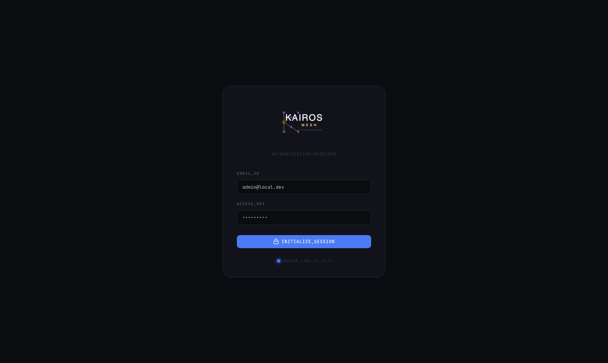

### Rôle

Point d'entrée unique de l'application. Aucune page n'est accessible sans authentification.

### Composants

| Élément | Description |
|---------|-------------|
| `EMAIL_ID` | Adresse e-mail du compte (pré-remplie avec `admin@local.dev` par défaut) |
| `ACCESS_KEY` | Mot de passe du compte |
| `INITIALIZE_SESSION` | Bouton de soumission du formulaire |
| `SECURE_LINK // V4.2` | Indicateur de version de l'interface |

### Identifiants par défaut

```
Email    : admin@local.dev
Password : admin1234
```

> Ces identifiants sont destinés aux environnements de développement local. Ils doivent être modifiés avant tout déploiement exposé à un réseau externe.

### Comportement après connexion

Un token JWT est émis par le backend FastAPI et stocké côté client. L'utilisateur est redirigé vers le Portfolio Dashboard. La session reste active jusqu'à expiration du token ou déconnexion explicite.

---

## 2. Terminal d'analyse

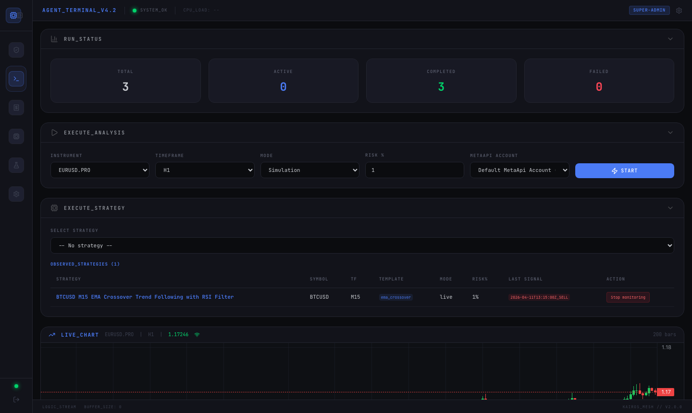

### Rôle

Page principale d'opération. Elle centralise le lancement manuel d'analyses, la surveillance des stratégies actives et l'affichage du graphique de prix en temps réel.

### Section `RUN_STATUS`

Compteurs globaux mis à jour en temps réel via WebSocket :

| Compteur | Signification |
|----------|--------------|
| `TOTAL` | Nombre total d'analyses lancées depuis le démarrage |
| `ACTIVE` | Analyses en cours d'exécution dans le pipeline |
| `COMPLETED` | Analyses terminées avec succès |
| `FAILED` | Analyses ayant échoué (erreur LLM, timeout, validation) |

### Section `EXECUTE_ANALYSIS`

Formulaire de lancement manuel d'une analyse à la demande.

| Champ | Options | Description |
|-------|---------|-------------|
| `INSTRUMENT` | Ex. `EURUSD.PRO`, `BTCUSD` | Instrument financier à analyser |
| `TIMEFRAME` | M1, M5, M15, H1, H4, D1 | Unité de temps des chandeliers |
| `MODE` | `Simulation`, `Paper`, `Live` | Mode d'exécution (voir [Paper vs Live](paper-vs-live.md)) |
| `RISK %` | Valeur numérique (ex. 1) | Pourcentage du capital alloué au risque par trade |
| `METAAPI ACCOUNT` | Compte MetaAPI configuré | Compte broker utilisé pour les modes Paper et Live |

Le bouton `START` déclenche l'exécution du pipeline 4 phases. Le résultat apparaît dans la liste des runs et dans la page Run Detail.

### Section `EXECUTE_STRATEGY`

Lancement d'une analyse liée à une stratégie existante. Le menu déroulant liste les stratégies enregistrées. La sélection d'une stratégie pré-remplit l'instrument et le timeframe depuis la configuration de la stratégie.

### Section `OBSERVED_STRATEGIES`

Liste des stratégies en cours de surveillance automatique par le scheduler Celery Beat. Pour chaque stratégie :

| Colonne | Description |
|---------|-------------|
| `STRATEGY` | Nom et description de la stratégie |
| `SYMBOL` | Instrument surveillé |
| `TF` | Timeframe |
| `TEMPLATE` | Template de signal utilisé |
| `MODE` | Mode d'exécution actif |
| `RISKS` | Paramètre de risque configuré |
| `LAST SIGNAL` | Horodatage du dernier signal détecté |
| `ACTION` | Bouton `Stop monitoring` pour désactiver la surveillance |

### Section `LIVE_CHART`

Graphique de prix en temps réel (TradingView Lightweight Charts). Il affiche les chandeliers OHLC de l'instrument sélectionné dans le formulaire d'analyse. Le graphique se met à jour à chaque nouveau tick reçu via WebSocket.

---

## 3. Détail d'une analyse (Run Detail)

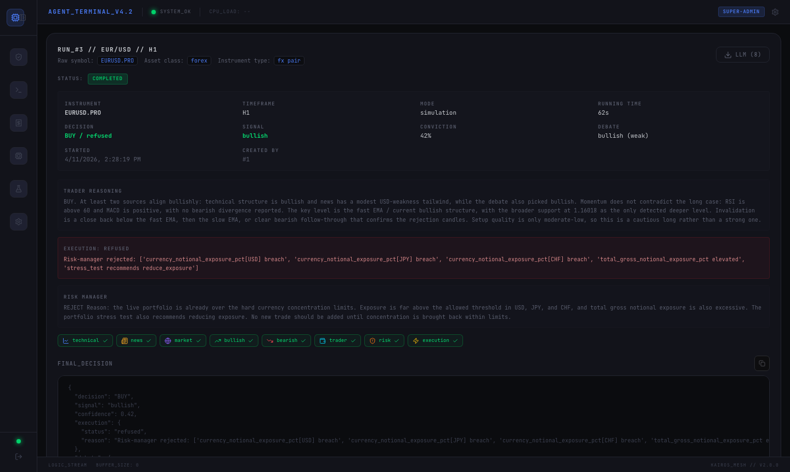

### Rôle

Vue complète du résultat d'une analyse. Accessible depuis la liste des runs ou directement via l'URL `/runs/<id>`. Elle expose la décision finale, le raisonnement de chaque agent et la trace d'exécution complète.

### En-tête du run

| Champ | Description |
|-------|-------------|
| `RUN_ID` | Identifiant unique de l'analyse |
| Instrument / Timeframe | Paramètres d'entrée utilisés |
| `DIRECTION` | Direction retenue par le trader-agent (`BUY`, `SELL`, `HOLD`) |
| `CONVICTION` | Score de conviction du trader (0.0 – 1.0) |
| `ATR` | Average True Range calculé sur les données OHLC |
| Statut | `completed`, `failed`, `running` |

### Timeline de phases

La barre de progression horizontale indique les 4 phases du pipeline :

1. **Phase 1** — Analyse parallèle (technical, news, market-context)
2. **Phase 2+3** — Débat (bullish vs bearish, si activé)
3. **Phase 4** — Décision trader → validation risk-manager → exécution

### Onglets agents

Chaque onglet correspond à un agent du pipeline. Il affiche :
- Le résultat structuré (schema Pydantic) de l'agent
- Les appels MCP tools effectués et leurs retours
- Le raisonnement brut de l'LLM (quand `llm_enabled=true`)

### Décision finale

La section inférieure présente la décision complète en JSON :
- `decision` : `BUY` / `SELL` / `HOLD`
- `entry`, `stop_loss`, `take_profit` : niveaux de prix calculés
- `approved` : résultat de la validation du risk-manager
- `adjusted_volume` : volume final après ajustement par le risk-manager
- `order_type` / `timing` : plan d'exécution de l'execution-manager

---

## 4. Tableau de bord Portfolio

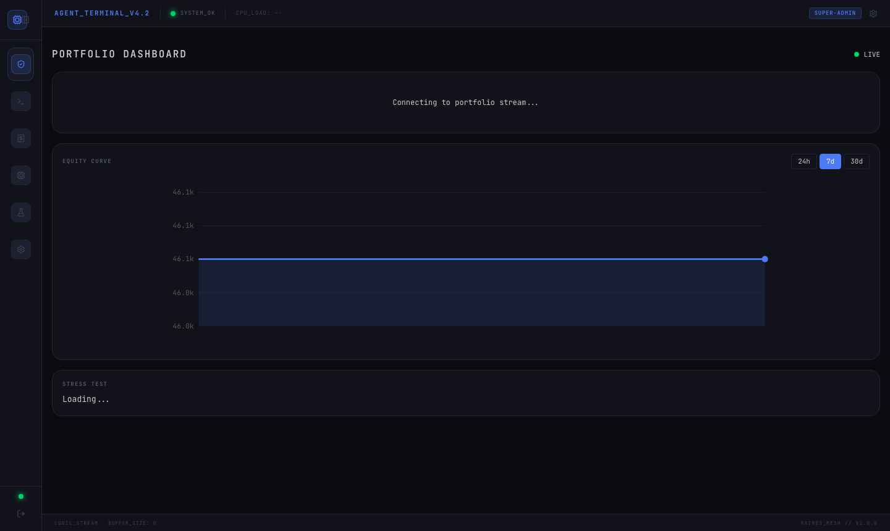

### Rôle

Vue en temps réel de l'état du portefeuille connecté via MetaAPI. Nécessite une connexion active à un compte broker (Paper ou Live) pour afficher des données complètes.

### Composants

#### Flux portfolio

La bannière supérieure indique l'état de la connexion WebSocket au flux MetaAPI :
- `Connecting to portfolio stream...` — connexion en cours ou compte non configuré
- Données en direct — balance, equity, free margin, positions ouvertes

#### Courbe d'équité (`EQUITY CURVE`)

Graphique d'évolution de l'equity dans le temps. Trois plages de temps disponibles : `24h`, `7d`, `30d`. Les données sont issues de l'historique des positions clôturées enregistrées en base.

#### Test de stress (`STRESS TEST`)

Simulation des scénarios de risque extrêmes sur le portefeuille actuel. Calculé par le risk-manager déterministe en appliquant des chocs de marché standards. S'affiche `Loading...` tant que le flux portfolio n'est pas établi.

> **Note** : Le tableau de bord nécessite `METAAPI_TOKEN` et `METAAPI_ACCOUNT_ID` configurés dans `backend/.env`. Sans ces paramètres, la section portfolio reste en état de connexion.

---

## 5. Ordres

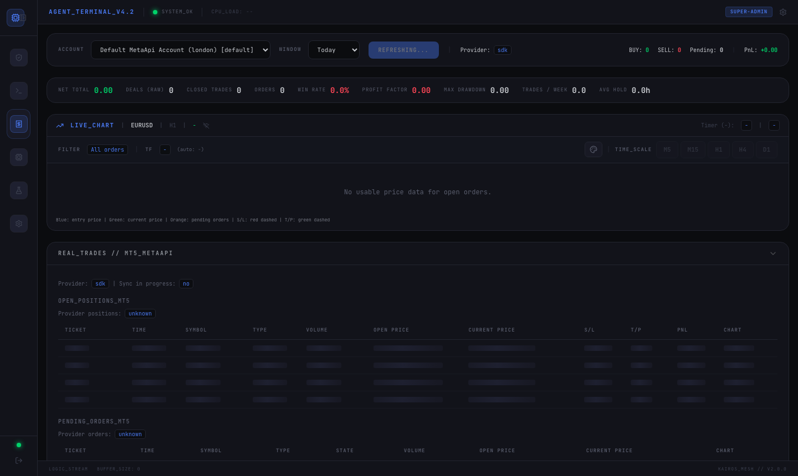

### Rôle

Vue centralisée de l'activité de trading : KPIs du compte, graphique de prix avec les trades ouverts, positions ouvertes et historique des trades clôturés.

### Barre de navigation secondaire

Onglets de navigation rapide entre les sous-vues :
- **MetaAPI** — données brutes du compte broker
- **Account** — balance, equity, margin
- **Connectors** — état des connexions broker
- **Candles** — données OHLC brutes
- **Trades** — liste des positions

### KPIs du compte

Métriques clés affichées en en-tête :
- `Balance`, `Equity`, `Free Margin`
- `Daily P&L`, `Weekly P&L`
- Nombre de positions ouvertes

### Graphique live avec trades

Le graphique OHLC (TradingView Lightweight Charts) superpose les marqueurs d'entrée et de sortie des trades sur le prix. Permet de visualiser rapidement la cohérence des décisions par rapport aux mouvements de marché.

### Positions ouvertes et historique

Tableaux tabulaires affichant :
- `Symbol`, `Volume`, `Open Price`, `Current Price`, `P&L`
- Horodatages d'ouverture et de clôture
- Identifiant de run ayant généré la position

---

## 6. Stratégies

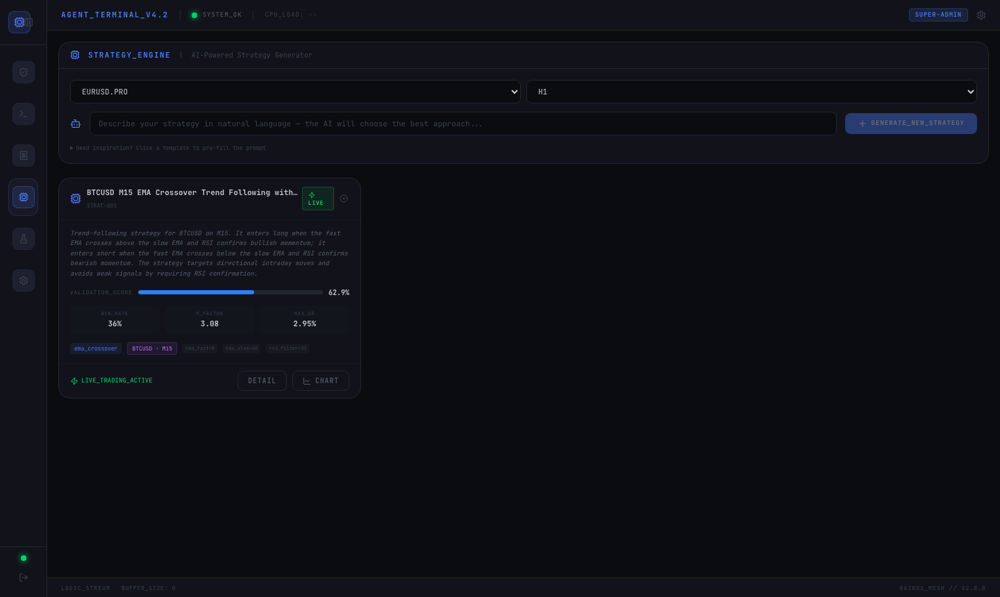

### Rôle

Page de création, consultation et gestion des stratégies de trading. Deux modes : génération assistée par LLM (description en langage naturel) ou sélection parmi les 20 templates prédéfinis.

### Générateur de stratégie

| Champ | Description |
|-------|-------------|
| Instrument | Instrument cible de la stratégie |
| Timeframe | Unité de temps |
| Zone de texte | Description libre de la stratégie en langage naturel |
| `GENERATE_NEW_STRATEGY` | Lance la génération LLM |

L'agent `strategy-designer` analyse la description, sélectionne le template le plus adapté parmi les 20 disponibles et configure les paramètres. La stratégie résultante est persistée en base de données.

### Carte de stratégie

Chaque stratégie s'affiche sous forme de carte avec :

| Élément | Description |
|---------|-------------|
| Nom | Nom généré par le LLM |
| Badge `LIVE` / `PAPER` / `SIM` | Mode d'exécution actif |
| Description | Raisonnement de génération |
| `ACTIVATION_SCORE` | Indicateur de qualité du dernier signal (0–100%) |
| Métriques | Win rate estimé, ratio risque/rendement, drawdown |
| Tags | Template utilisé, instrument, timeframe |
| `LIVE_TRADING_ACTIVE` | Indique que la stratégie est en surveillance active |
| `DETAIL` | Navigue vers la configuration détaillée |
| `CHART` | Affiche le graphique de performance |

> **Note** : `ACTIVATION_SCORE` reflète la force du dernier signal, pas une performance historique validée. Pour évaluer la robustesse d'une stratégie, utilisez la page Backtests.

---

## 7. Backtests

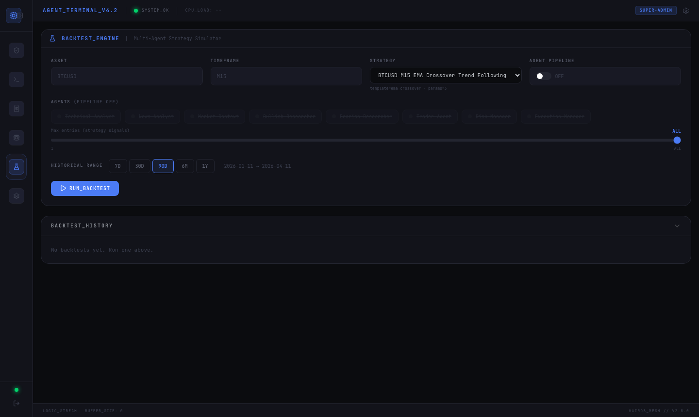

### Rôle

Simulation historique d'une stratégie sur des données passées. Deux modes : simulation pure basée sur les règles du template (pipeline désactivé) ou simulation avec le pipeline LLM complet (coûteux en temps et en tokens).

### Formulaire de configuration

| Champ | Description |
|-------|-------------|
| `ASSET` | Instrument à backtester |
| `TIMEFRAME` | Timeframe des chandeliers historiques |
| `STRATEGY` | Stratégie à évaluer (liste des stratégies enregistrées) |
| `AGENT PIPELINE` | Activer ou désactiver le pipeline LLM complet |
| Agents individuels | Sélection fine des agents à inclure (quand pipeline activé) |
| `Max entries` | Nombre maximum de signaux à simuler (curseur : 1 → ALL) |
| `HISTORICAL RANGE` | Plage temporelle : 7D, 30D, 90D, 6M, 1Y |

Le bouton `RUN_BACKTEST` soumet la tâche au worker Celery. L'exécution est asynchrone.

### Pipeline désactivé (mode déterministe)

Quand `AGENT PIPELINE = OFF`, le backtest utilise uniquement les règles du template de signal (indicateurs techniques) sans appel LLM. C'est le mode recommandé pour les itérations rapides de paramétrage.

### Pipeline activé (mode LLM)

Quand `AGENT PIPELINE = ON`, chaque signal potentiel est soumis au pipeline 4 phases complet. Chaque agent LLM activé est invoqué, ce qui augmente significativement la durée et le coût d'exécution.

### Historique des backtests (`BACKTEST_HISTORY`)

Liste des backtests précédemment exécutés avec leurs résultats : win rate, nombre de trades simulés, P&L total, drawdown maximum. Chaque entrée est cliquable pour consulter le détail complet.

---

## 8. Connecteurs et configuration système

La page Connecteurs (`/connectors`) regroupe la configuration opérationnelle du système sous quatre onglets.

### En-tête global

Affiche l'état consolidé du système LLM :

| Indicateur | Description |
|------------|-------------|
| `LLM` | État de la connexion LLM (Online / Offline) |
| `Provider` | Fournisseur LLM actif (`openai`, `ollama`, `mistral`) |
| `AVG COST` | Coût moyen par analyse (en USD) |
| `LATENCY` | Latence moyenne des appels LLM |

---

### Onglet Connectors

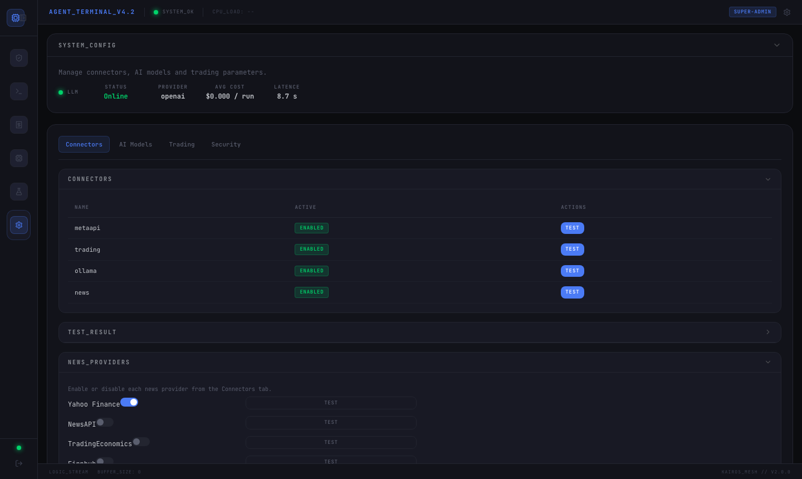

Gestion des connexions aux services externes.

#### Section `CONNECTORS`

| Connecteur | Description | Actions |
|------------|-------------|---------|
| `metaapi` | Connexion au broker MT4/MT5 via MetaAPI | `TEST` |
| `trading` | Service d'exécution d'ordres | `TEST` |
| `ollama` | Serveur LLM local Ollama | `TEST` |
| `news` | Agrégateur de news financières | `TEST` |

Le bouton `TEST` vérifie la connectivité en temps réel. Le résultat s'affiche dans la section `TEST_RESULT`.

#### Section `NEWS_PROVIDERS`

Activation individuelle des sources de news :
- **Yahoo Finance** — actif par défaut (toggle)
- **NewsAPI** — requiert une clé API
- **TradingEconomics** — requiert une clé API
- **Finneas** — requiert une clé API

---

### Onglet AI Models

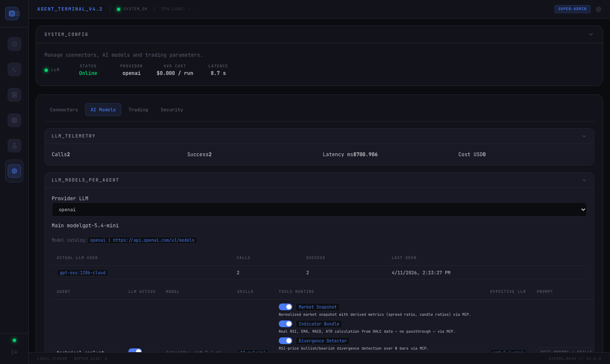

Configuration des modèles LLM et activation par agent.

#### Section `LLM_PROVIDERS`

Tableau des fournisseurs LLM configurés :

| Colonne | Description |
|---------|-------------|
| `Name` | Identifiant du fournisseur (`openai`, `ollama`, `mistral`) |
| `Enabled` | Activer / désactiver le fournisseur |
| `Latency` | Latence mesurée lors du dernier appel |
| `Cost / 1M` | Coût estimé pour 1 million de tokens |

#### Section `PROVIDERS`

Sélection du modèle actif par fournisseur. Ex : `gpt-4o-mini`, `llama3`, `mistral-small`.

#### Activation par agent

Toggle individuel `llm_enabled` pour chacun des 8 agents. Quand désactivé, l'agent s'exécute en mode déterministe (appels MCP directs, sans inférence LLM). Cette configuration est persistée en base de données et prend priorité sur le fichier `agent-skills.json`.

> Désactiver les agents de débat (`bullish-researcher`, `bearish-researcher` ou `trader-agent`) supprime entièrement la Phase 2+3 du pipeline.

---

### Onglet Trading

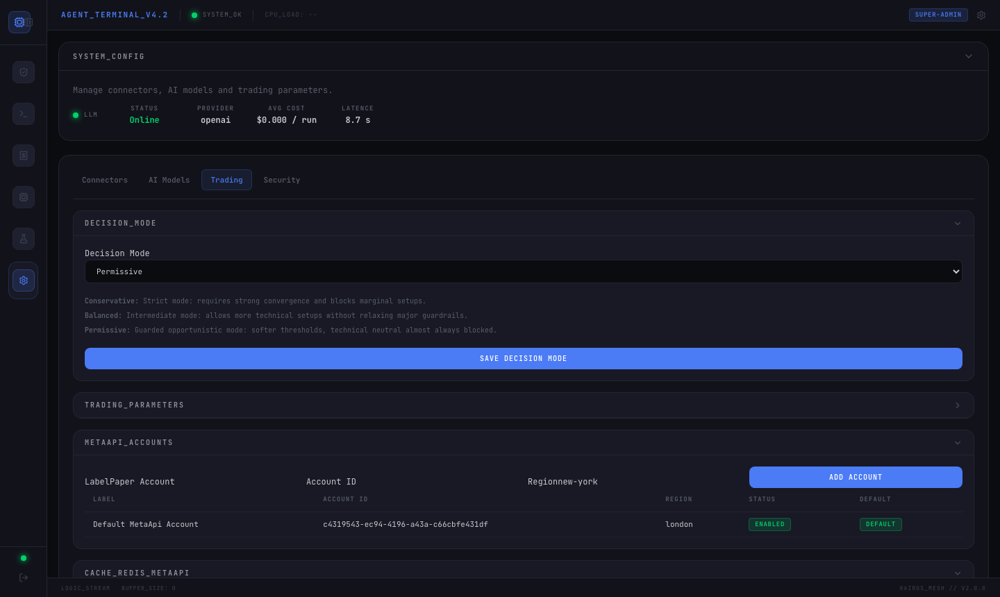

Paramètres de trading et comptes broker.

#### `DECISION_MODE`

Politique de seuillage appliquée par le `decision_gating` MCP tool :

| Mode | Usage |
|------|-------|
| `Conservative` | Seuils élevés — peu de trades, signaux de haute conviction uniquement |
| `Balanced` | Mode par défaut — équilibre entre fréquence et qualité |
| `Permissive` | Seuils bas — plus de trades, tolérance accrue aux signaux mixtes |

#### `TRADING_PARAMETERS`

Configuration de la session MetaAPI active : URL de l'API, identifiant de session, paramètres de connexion broker.

#### `BROKER_ACCOUNTS`

Liste des comptes MetaAPI configurés avec leur identifiant, mode (Paper / Live) et statut de connexion. Permet d'ajouter un nouveau compte ou de définir le compte actif utilisé par défaut dans le terminal.

---

### Onglet Security

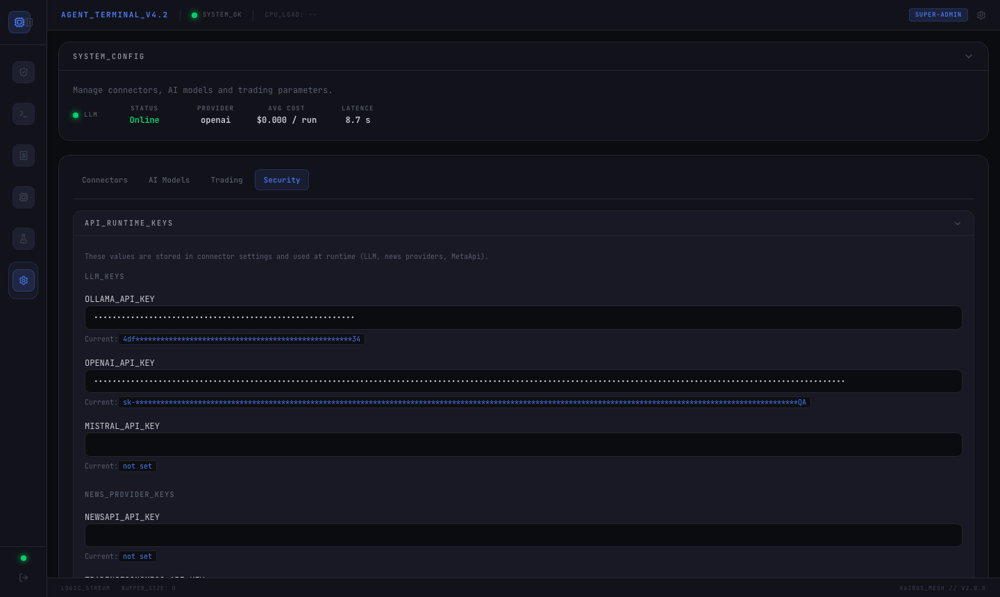

Gestion des clés API utilisées par le backend.

#### `API_RUNTIME_KEYS`

Champs de saisie masqués pour les clés API sensibles :

| Clé | Usage |
|-----|-------|
| `CLAUDE_API_KEY` | Anthropic Claude (si utilisé comme provider LLM) |
| `OPENAI_API_KEY` | OpenAI GPT models |
| `MISTRAL_API_KEY` | Mistral AI models |
| `RENDER_API_KEY` | Clé de déploiement Render (si applicable) |

> Ces clés sont stockées dans la base de données et utilisées au runtime par le backend. Elles ne sont jamais exposées dans les réponses API ou dans les logs. La modification d'une clé prend effet immédiatement sans redémarrage.

---

## Navigation globale

La barre de navigation latérale gauche est présente sur toutes les pages authentifiées :

| Icône | Page | URL |
|-------|------|-----|
| Tableau de bord | Portfolio Dashboard | `/` |
| Terminal | Agent Terminal | `/terminal` |
| Ordres | Orders | `/orders` |
| Stratégies | Strategy Engine | `/strategies` |
| Backtests | Backtest Engine | `/backtests` |
| Connecteurs | System Config | `/connectors` |

L'en-tête global affiche en permanence :
- `AGENT_TERMINAL_V4.2` — version de l'interface
- `SYSTEM_OK` — état global du backend (vert = opérationnel)
- `CPU_LOAD` — charge processeur du serveur (mise à jour périodique)
- Rôle utilisateur (`SUPER-ADMIN`) + accès aux paramètres du compte

---

## Lectures complémentaires

- [Runtime Flow](runtime-flow.md) — déroulement étape par étape d'une analyse
- [Agents](agents.md) — rôle et schéma de sortie de chaque agent
- [Configuration](configuration.md) — toutes les variables d'environnement
- [Paper vs Live](paper-vs-live.md) — différences entre les modes d'exécution
- [Limitations](limitations.md) — contraintes connues avant mise en production
